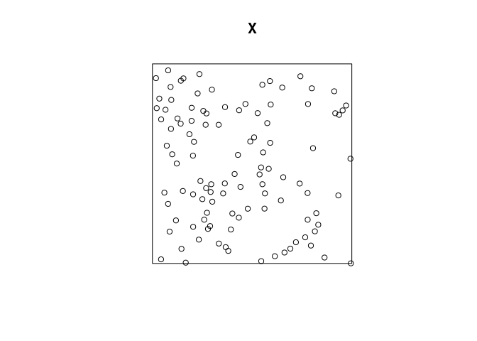
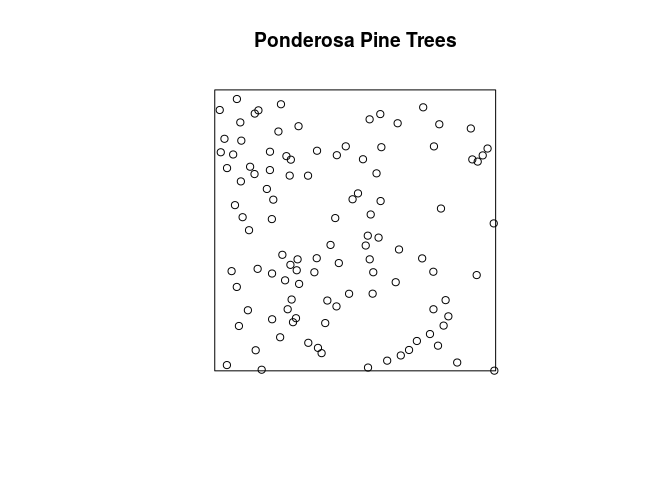
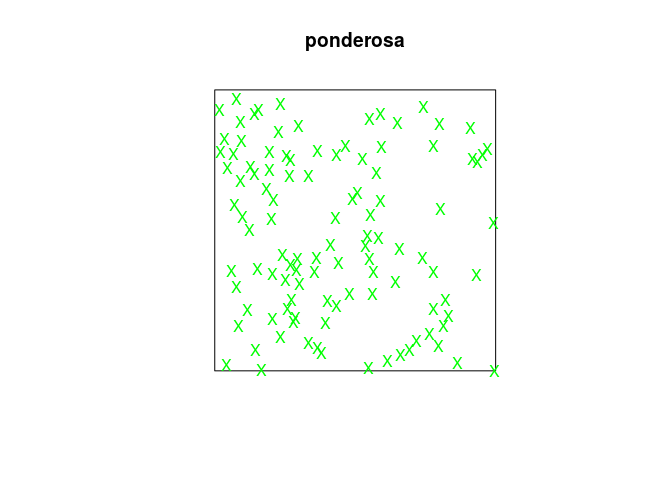
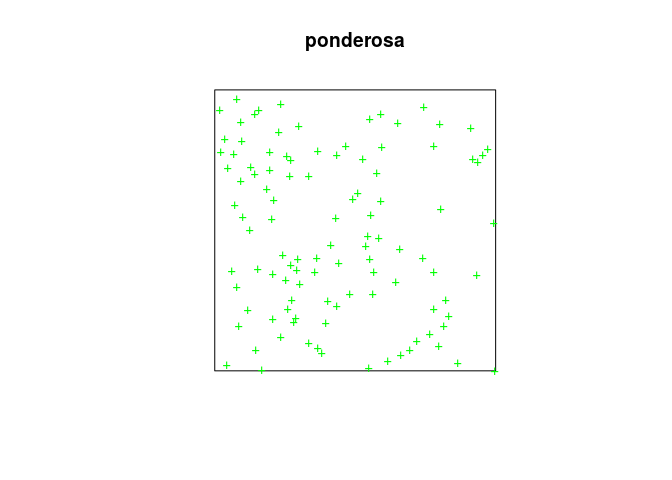
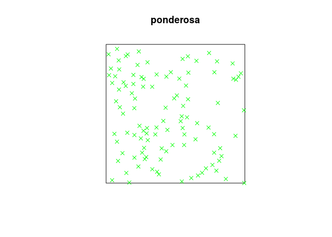
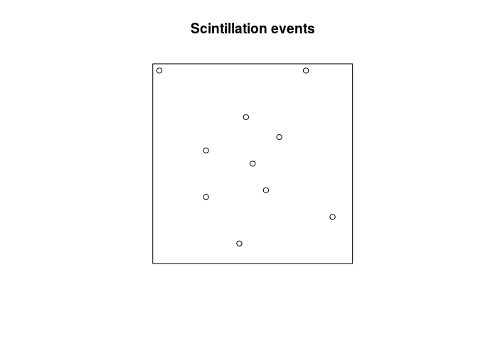
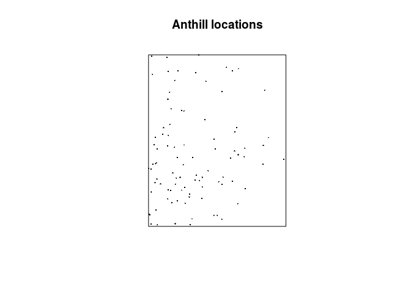

Lab 1: Introduction
================

This session is about reading in, displaying and summarising point patterns.
The lecturer's R script is [available here](https://raw.githubusercontent.com/spatstat/SSAI2017/master/Scripts/script01.R) (right click and save).

If you have not already done so, you’ll need to start R and load the `spatstat` package by typing

``` r
library(spatstat)
```

### Exercise 1

We will study a dataset that records the locations of Ponderosa Pine trees (*Pinus ponderosa*) in a study region in the Klamath National Forest in northern California. The data are included with `spatstat` as the dataset `ponderosa`.

1.  assign the data to a shorter name, like `X` or `P`;

    To assign the data to `X` we simply write:

    ``` r
    X <- ponderosa
    ```

2.  plot the data;

    To plot the data we do the following:

    ``` r
    plot(X)
    ```

    

    By the S3 method dispatch, this calls the `plot.ppp` function. The `chars` argument indicate that the point type should be be periods ("`.`").

3.  find out how many trees are recorded;

    Both `npoints` and `print.ppp` displays the number of recorded trees:

    ``` r
    npoints(X)
    ```

        ## [1] 108

    ``` r
    print(X)
    ```

        ## Planar point pattern: 108 points
        ## window: rectangle = [0, 120] x [0, 120] metres

    I.e. there are 108 trees in the dataset.

4.  find the dimensions of the study region;

    The dimensions of the observation window can be seen above. Alternatively, it can be directly assesed via

    ``` r
    window(X)
    ```

        ## Planar point pattern: 5 points
        ## window: rectangle = [0, 120] x [0, 120] metres

5.  obtain an estimate of the average intensity of trees (number of trees per unit area).

    The average intensity can be computed via `intensity.ppp`

    ``` r
    intensity(X)
    ```

        ## [1] 0.0075

    or the more expansive `summary.ppp`:

    ``` r
    summary(X)
    ```

        ## Planar point pattern:  108 points
        ## Average intensity 0.0075 points per square metre
        ## 
        ## Coordinates are given to 3 decimal places
        ## i.e. rounded to the nearest multiple of 0.001 metres
        ## 
        ## Window: rectangle = [0, 120] x [0, 120] metres
        ## Window area = 14400 square metres
        ## Unit of length: 1 metre

### Exercise 2

The Ponderosa data, continued:

1.  When you type `plot(ponderosa)`, the command that is actually executed is `plot.ppp`, the plot method for point patterns. Read the help file for the function `plot.ppp`, and find out which argument to the function can be used to control the main title for the plot;

    From the documentation, the argument that controls the title is `main` as is also the case in the regular generic `plot`.

2.  plot the Ponderosa data with the title *Ponderosa Pine Trees* above it;

    ``` r
    plot(ponderosa, main = "Ponderosa Pine Trees")
    ```

    

3.  from your reading of the help file, predict what will happen if we type

    ``` r
    plot(ponderosa, chars="X", cols="green")
    ```

    then check that your guess was correct;

    Each point will be plotted as an green "X" and indeed:

    ``` r
    plot(ponderosa, chars="X", cols="green")
    ```

    

4.  try different values of the argument `chars`, for example, one of the integers 0 to 25, or a letter of the alphabet. (Note the difference between `chars=3` and `chars="+"`, and the difference between `chars=4` and `chars="X"`).

    There are subtle differences in the actual character/point types plotted. When given a string literal, the actual character is plotted as the point type.

    ``` r
    plot(ponderosa, chars=3, cols="green")
    ```

    

    ``` r
    plot(ponderosa, chars="+", cols="green")
    ```

    

    ``` r
    plot(ponderosa, chars=4, cols="green")
    ```

    

    ``` r
    plot(ponderosa, chars="X", cols="green")
    ```

    

### Exercise 3

The following vectors record the locations of 10 scintillation events observed under a microscope. Coordinates are given in microns, and the study region was 30 × 30 microns, with the origin at the bottom left corner.

``` r
x <- c(13, 15, 27, 17, 8, 8, 1, 14, 19, 23)
y <- c(3, 15, 7, 11, 10, 17, 29, 22, 19, 29)
```

Create a point pattern `X` from the data, and plot the point pattern (use `owin` or `square` to define the study region).

To define the observation window we do:

``` r
w <- owin(c(0, 30), c(0, 30), unitname = c("micron", "microns"))
```

With this window, we create the `ppp` object with the funciton of the same name and plot it:

``` r
P <- ppp(x = x, y = y, window = w)
plot(P, main = "Scintillation events")
```



### Exercise 4

The file `anthills.txt` is available in the Data directory on [GitHub](https://github.com/spatstat/SSAI2017) and downloadable by [this direct link](https://raw.githubusercontent.com/spatstat/SSAI2017/master/Data/anthills.txt) (right click and save).

It records the locations of anthills recorded in a 1200x1500 metre study region in northern Australia. Coordinates are given in metres, along with a letter code recording the ecological ‘status’ of each anthill (in this exercise we will ignore this letter code).

1.  read the data into `R` as a data frame, using the `R` function `read.table`. (Since the input file has a header line, you will need to use the argument `header=TRUE` when you call `read.table`.)

    We read the data into R with the line:

    ``` r
    dat <- read.table(file = "../Data/anthills.txt", header = TRUE)
    ```

2.  check the data for any peculiarities.

    Looking at the first entries of the dataset with

    ``` r
    head(dat)
    ```

        ##     x    y status
        ## 1 105  372      j
        ## 2  65  142      g
        ## 3 132  862      f
        ## 4  22   19      g
        ## 5 185 1173      e
        ## 6  69  557      f

    We see that there is a `status` variable indicating that this is a *marked* point process.

3.  create a point pattern `hills` containing these data. Ensure that the unit of length is given its correct name.

    As before

    ``` r
    hills <- with(dat, ppp(x, y, xrange = c(0, 1200), yrange = c(0, 1500), 
                           units=c("metre", "metres")))
    ```

    The `ppp` function passes the appropriate arguments to `owin` which we therefore do not need to call explicitly.

4.  plot the data.

    As before, we can now plot the data:

    ``` r
    plot(hills, pch = 16, cex = 0.3, main = "Anthill locations")
    ```

    
