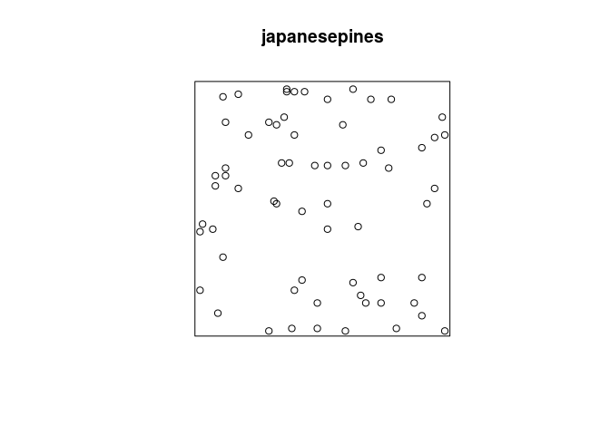
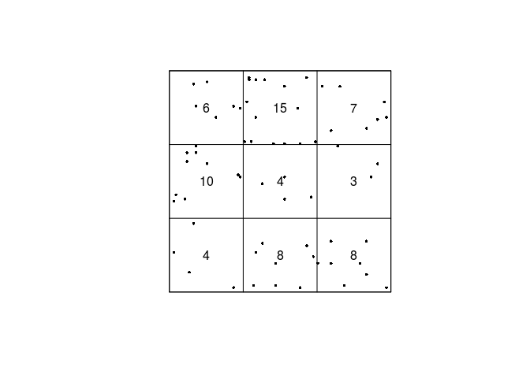
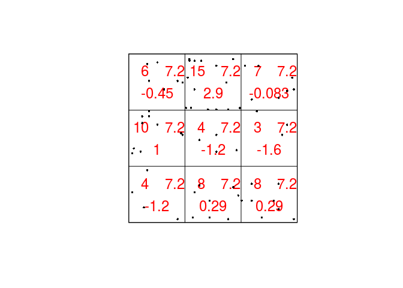
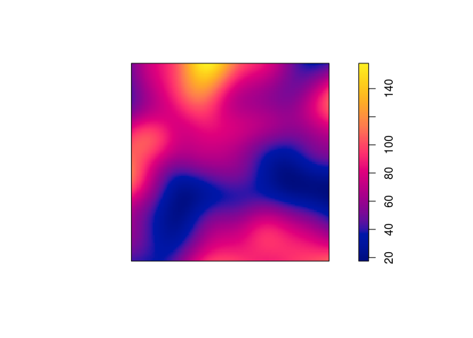
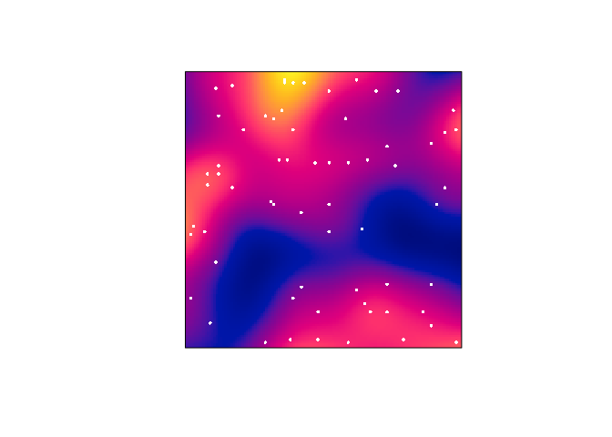
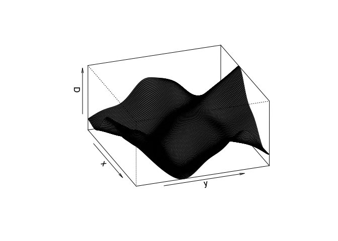

Lab 2: Intensity
================

This session covers exploratory tools for investigating intensity.
The lecturer's R script is [available here](https://raw.githubusercontent.com/spatstat/SSAI2017/master/Scripts/script02.R) (right click and save).

``` r
library(spatstat)
```

### Exercise 1

The dataset `japanesepines` contains the locations of Japanese Black Pine trees in a study region.

1.  Plot the `japanesepines` data.

    ``` r
    plot(japanesepines)
    ```

    

2.  Use the command `quadratcount` to divide the study region of the Japanese Pines data into a 3x3 array of equal quadrats, and count the number of trees in each quadrat.

    We count the number of Japanese Pines and print the results:

    ``` r
    qc <- quadratcount(japanesepines, nx = 3)
    qc
    ```

        ##                                        x
        ## y                                       [0,0.333333333333333)
        ##   [0.666666666666667,1]                                     6
        ##   [0.333333333333333,0.666666666666667)                    10
        ##   [0,0.333333333333333)                                     4
        ##                                        x
        ## y                                       [0.333333333333333,0.666666666666667)
        ##   [0.666666666666667,1]                                                    15
        ##   [0.333333333333333,0.666666666666667)                                     4
        ##   [0,0.333333333333333)                                                     8
        ##                                        x
        ## y                                       [0.666666666666667,1]
        ##   [0.666666666666667,1]                                     7
        ##   [0.333333333333333,0.666666666666667)                     3
        ##   [0,0.333333333333333)                                     8

    By default, `quadratcount` uses the same number of division of the y-axis as given by `nx`.

3.  Most plotting commands will accept the argument `add=TRUE` and interpret it to mean that the plot should be drawn over the existing display, without clearing the screen beforehand. Use this to plot the Japanese Pines data, and superimposed on this, the 3x3 array of quadrats, with the quadrat counts also displayed.

    We do the superimposed plotting in the following manner:

    ``` r
    plot(qc, main = "")
    plot(japanesepines, add = TRUE, pch = 16, cex = 0.5)
    ```

    

4.  Use the command `quadrat.test` to perform the *χ*-square test of CSR on the Japanese Pines data.

    We do the Chi-squarred test with the following line.

    ``` r
    chisq.res <- quadrat.test(qc)
    print(chisq.res)
    ```

        ## 
        ##  Chi-squared test of CSR using quadrat counts
        ##  Pearson X2 statistic
        ## 
        ## data:  
        ## X2 = 15.169, df = 8, p-value = 0.1119
        ## alternative hypothesis: two.sided
        ## 
        ## Quadrats: 3 by 3 grid of tiles

    As seen by the P-value, there seems to be no strong evidence for an over- or under-representation of points in any of the quadrats.

5.  Plot the Japanese Pines data, and superimposed on this, the 3x3 array of quadrats and the observed, expected and residual counts. Use the argument `cex` to make the numerals larger and `col` to display them in another colour.

    To plot the expected, observed, and residual counts we do the following:

    ``` r
    plot(chisq.res, main = "", cex = 1.5, col = "red")
    plot(japanesepines, add = TRUE, cex = 0.5, pch = 16)
    ```

    

### Exercise 2

Japanese Pines, continued:

1.  Using `density.ppp`, compute a kernel estimate of the spatially-varying intensity function for the Japanese pines data, using a Gaussian kernel with standard deviation *σ* = 0.1 units, and store the estimated intensity in an object `D` say.

    From the documentation (`?density.ppp`) we see that the following will work:

    ``` r
    D <- density(japanesepines, sigma = 0.1)
    ```

2.  Plot a colour image of the kernel estimate `D`.

    The plotting of the colour image is automatically done by dispatched call to the `plot.im` method by calling `plot` on the `im` object.

    ``` r
    plot(D, main = "")
    ```

    

3.  Plot a colour image of the kernel estimate `D` with the original Japanese Pines data superimposed.

    Again, we can use the `add = TRUE` functionality of the plotting methods.

    ``` r
    plot(D, main = "")
    plot(japanesepines, add = TRUE, cols = "white", cex = 0.5, pch = 16)
    ```

    

4.  Plot the kernel estimate without the ‘colour ribbon’.

    From `help("plot.im")` we see that `ribbon = FALSE` disables the colour key:

    ``` r
    plot(D, main = "", ribbon = FALSE)
    plot(japanesepines, add = TRUE, cols = "white", cex = 0.5, pch = 16)
    ```

    

5.  Try the following command

    ``` r
    persp(D, theta=70, phi=25, shade=0.4)
    ```

    and find the documentation for the arguments `theta`, `phi` and `shade`.

    It dispatches to `persp.im`, but these arguments are then passed down to `persp.default` through the dots (`...`). From the documentation of `persp.default` they are "angles defining the viewing direction. `theta` gives the azimuthal direction and `phi` the colatitude." The `shade` controls the shading of the surface facets.

    ``` r
    persp(D, theta=70, phi=25, shade=0.4, main = "")
    ```

    

### Exercise 3

More Japanese Pines:

1.  Compute a kernel estimate of the intensity for the Japanese Pines data using a Gaussian kernel with standard deviation *σ* = 0.15.

    As before:

    ``` r
    D2 <- density(japanesepines, sigma = 0.15)
    ```

2.  Find the maximum and minimum values of the intensity estimate over the study region. (Hint: Use `summary` or `range`)

    Both `summary` and `range` show the intensity range:

    ``` r
    range(D2)
    ```

        ## [1]  31.30041 118.22184

    ``` r
    summary(D2)
    ```

        ## real-valued pixel image
        ## 128 x 128 pixel array (ny, nx)
        ## enclosing rectangle: [0, 1] x [0, 1] units (one unit = 5.7 metres)
        ## dimensions of each pixel: 0.00781 x 0.0078125 units
        ## (one unit = 5.7 metres)
        ## Image is defined on the full rectangular grid
        ## Frame area = 1 square units
        ## Pixel values
        ##  range = [31.30041, 118.2218]
        ##  integral = 63.41479
        ##  mean = 63.41479

3.  The kernel estimate of intensity is defined so that its integral over the entire study region is equal to the number of points in the data pattern, ignoring edge effects. Check whether this is approximately true in this example. (Hint: use `integral`)

    This seems to be true by the following output:

    ``` r
    integral(D2)
    ```

        ## [1] 63.41479

    ``` r
    japanesepines
    ```

        ## Planar point pattern: 65 points
        ## window: rectangle = [0, 1] x [0, 1] units (one unit = 5.7 metres)
