Lab 4: Fitting Poisson models
================

This session is concerned with Poisson point process models.
The lecturer's R script is [available here](https://raw.githubusercontent.com/spatstat/SSAI2017/master/Scripts/script04.R) (right click and save).

``` r
library(spatstat)
```

### Exercise 1

The command `rpoispp(100)` generates realisations of the Poisson process with intensity *λ* = 100 in the unit square.

1.  Repeat the command `plot(rpoispp(100))` several times to build your intuition about the appearance of a completely random pattern of points.

    Let's plot it three times:

    ``` r
    replicate(3, plot(rpoispp(lambda = 100), main = ""))
    ```

    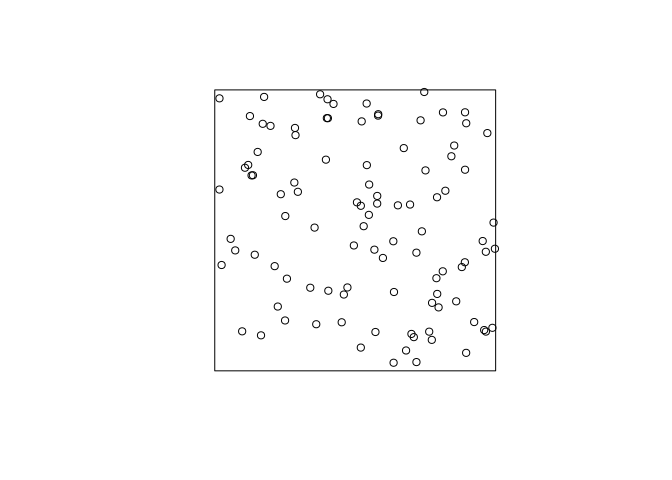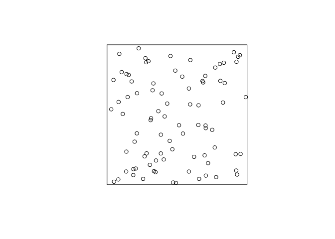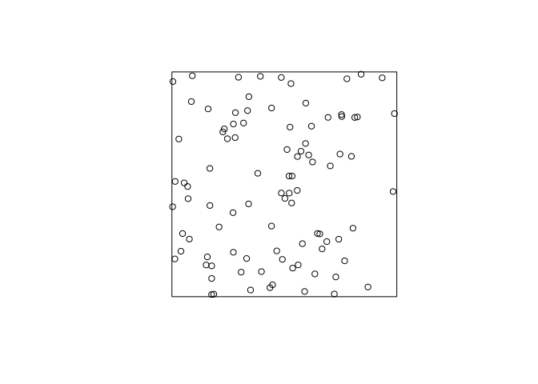

    As can be seen, the points (unsurprisingly) are much more random that want one might think. "Randomly" drawing points on a piece of paper one would usually draw a point pattern that is more regular (i.e. the points are repulsive).

2.  Try the same thing with intensity *λ* = 1.5.

    For brevity we only do it once here:

    ``` r
    plot(rpoispp(lambda = 1.5), main = "")
    ```

    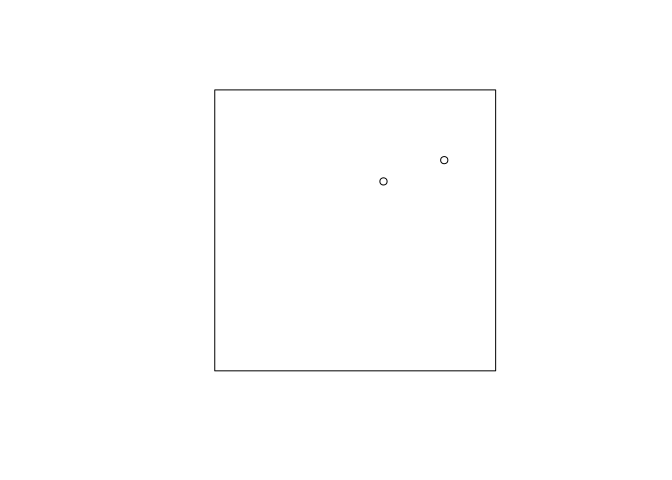

    Here we expect 1.5 points in the plot each time.

### Exercise 2

Returning to the Japanese Pines data,

1.  Fit the uniform Poisson point process model to the Japanese Pines data

    ``` r
    ppm(japanesepines~1)
    ```

    We fit the Poisson process model with the given command and print the output:

    ``` r
    m.jp <- ppm(japanesepines ~ 1)
    print(m.jp)
    ```

        ## Stationary Poisson process
        ## Intensity: 65
        ##             Estimate      S.E.  CI95.lo  CI95.hi Ztest     Zval
        ## log(lambda) 4.174387 0.1240347 3.931284 4.417491   *** 33.65499

2.  Read off the fitted intensity. Check that this is the correct value of the maximum likelihood estimate of the intensity.

    We extract the coeficient with the `coef` function, and compare to the straightforward estimate obtained by \`intensity\`\`:

    ``` r
    unname(exp(coef(m.jp)))
    ```

        ## [1] 65

    ``` r
    intensity(japanesepines)
    ```

        ## [1] 65

    As seen, they agree exactly.

### Exercise 3

The `japanesepines` dataset is believed to exhibit spatial inhomogeneity.

1.  Plot a kernel smoothed intensity estimate.

    Plot the kernel smoothed intensity estimate selecting the bandwidth with `bw.scott`:

    ``` r
    jp.dens <- density(japanesepines, sigma = bw.scott)
    plot(jp.dens)
    plot(japanesepines, col = "white", cex = .4, pch = 16, add = TRUE)
    ```

    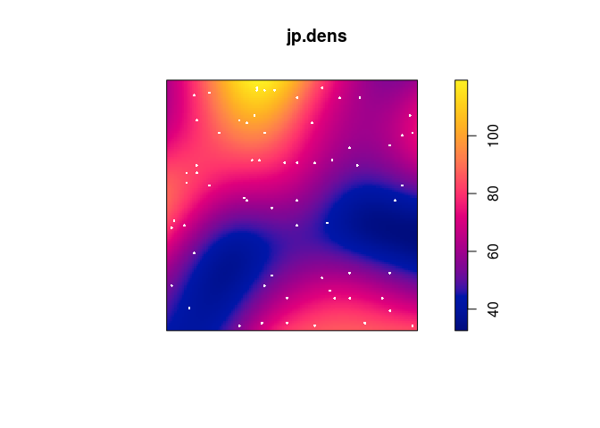

2.  Fit the Poisson point process models with loglinear intensity (trend formula `~x+y`) and log-quadratic intensity (trend formula `~polynom(x,y,2)`) to the Japanese Pines data.

    We fit the two models with `ppm`:

    ``` r
    jp.m <- ppm(japanesepines ~ x + y)
    jp.m2 <- ppm(japanesepines ~ polynom(x, y, 2) )
    ```

3.  extract the fitted coefficients for these models using `coef`.

    ``` r
    coef(jp.m)
    ```

        ## (Intercept)           x           y 
        ##   4.0670790  -0.2349641   0.4296171

    ``` r
    coef(jp.m2)
    ```

        ## (Intercept)           x           y      I(x^2)    I(x * y)      I(y^2) 
        ##   4.0645501   1.1436854  -1.5613621  -0.7490094  -1.2009245   2.5061569

4.  Plot the fitted model intensity (using `plot(predict(fit))`)

    ``` r
    par(mar=rep(0,4))
    plot(predict(jp.m), main = "")
    ```

    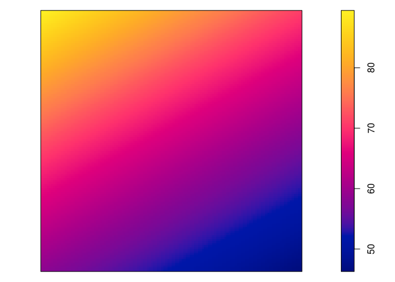

    ``` r
    plot(predict(jp.m, se=TRUE)$se, main = "")
    ```

    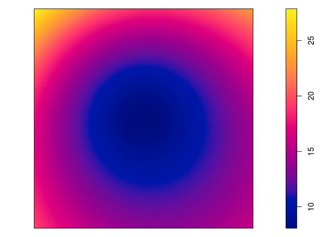

    ``` r
    plot(predict(jp.m2), main = "")
    ```

    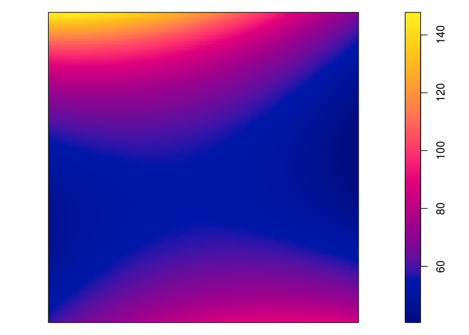

    ``` r
    plot(predict(jp.m2, se=TRUE)$se, main = "")
    ```

    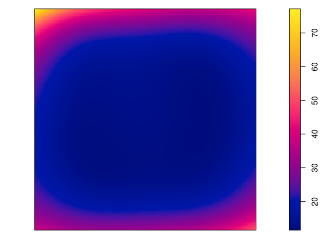

5.  perform the Likelihood Ratio Test for the null hypothesis of a loglinear intensity against the alternative of a log-quadratic intensity, using `anova`.

    ``` r
    anova(jp.m, jp.m2)
    ```

        ## Analysis of Deviance Table
        ## 
        ## Model 1: ~x + y   Poisson
        ## Model 2: ~x + y + I(x^2) + I(x * y) + I(y^2)      Poisson
        ##   Npar Df Deviance
        ## 1    3            
        ## 2    6  3   3.3851

6.  Generate 10 simulated realisations of the fitted log-quadratic model, and plot them, using `plot(simulate(fit, nsim=10))` where `fit` is the fitted model.

    ``` r
    par(mar=rep(0.5,4))
    plot(simulate(jp.m2, nsim=10), main = "")
    ```

        ## Generating 10 simulated patterns ...1, 2, 3, 4, 5, 6, 7, 8, 9,  10.

    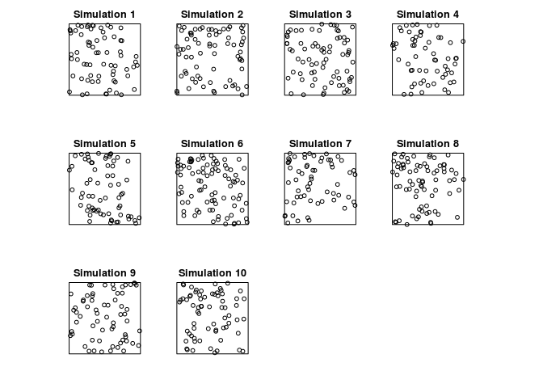

### Exercise 4

The `update` command can be used to re-fit a point process model using a different model formula.

1.  Type the following commands and interpret the results:

    ``` r
    fit0 <- ppm(japanesepines ~ 1)
    fit1 <- update(fit0, . ~ x)
    fit1
    ```

        ## Nonstationary Poisson process
        ## 
        ## Log intensity:  ~x
        ## 
        ## Fitted trend coefficients:
        ## (Intercept)           x 
        ##   4.2895587  -0.2349362 
        ## 
        ##               Estimate      S.E.   CI95.lo   CI95.hi Ztest       Zval
        ## (Intercept)  4.2895587 0.2411952  3.816825 4.7622926   *** 17.7845936
        ## x           -0.2349362 0.4305416 -1.078782 0.6089098       -0.5456759

    ``` r
    fit2 <- update(fit1, . ~ . + y)
    fit2
    ```

        ## Nonstationary Poisson process
        ## 
        ## Log intensity:  ~x + y
        ## 
        ## Fitted trend coefficients:
        ## (Intercept)           x           y 
        ##   4.0670790  -0.2349641   0.4296171 
        ## 
        ##               Estimate      S.E.    CI95.lo   CI95.hi Ztest       Zval
        ## (Intercept)  4.0670790 0.3341802  3.4120978 4.7220602   *** 12.1703167
        ## x           -0.2349641 0.4305456 -1.0788181 0.6088898       -0.5457357
        ## y            0.4296171 0.4318102 -0.4167154 1.2759495        0.9949211

    OK, let's do that:

    ``` r
    fit0 <- ppm(japanesepines ~ 1)
    fit1 <- update(fit0, . ~ x)
    fit1
    ```

        ## Nonstationary Poisson process
        ## 
        ## Log intensity:  ~x
        ## 
        ## Fitted trend coefficients:
        ## (Intercept)           x 
        ##   4.2895587  -0.2349362 
        ## 
        ##               Estimate      S.E.   CI95.lo   CI95.hi Ztest       Zval
        ## (Intercept)  4.2895587 0.2411952  3.816825 4.7622926   *** 17.7845936
        ## x           -0.2349362 0.4305416 -1.078782 0.6089098       -0.5456759

    ``` r
    fit2 <- update(fit1, . ~ . + y)
    fit2
    ```

        ## Nonstationary Poisson process
        ## 
        ## Log intensity:  ~x + y
        ## 
        ## Fitted trend coefficients:
        ## (Intercept)           x           y 
        ##   4.0670790  -0.2349641   0.4296171 
        ## 
        ##               Estimate      S.E.    CI95.lo   CI95.hi Ztest       Zval
        ## (Intercept)  4.0670790 0.3341802  3.4120978 4.7220602   *** 12.1703167
        ## x           -0.2349641 0.4305456 -1.0788181 0.6088898       -0.5457357
        ## y            0.4296171 0.4318102 -0.4167154 1.2759495        0.9949211

2.  Now type `step(fit2)` and interpret the results.

    The backwards selection is done with the code:

    ``` r
    step(fit2)
    ```

        ## Start:  AIC=-407.96
        ## ~x + y
        ## 
        ##        Df     AIC
        ## - x     1 -409.66
        ## - y     1 -408.97
        ## <none>    -407.96
        ## 
        ## Step:  AIC=-409.66
        ## ~y
        ## 
        ##        Df     AIC
        ## - y     1 -410.67
        ## <none>    -409.66
        ## 
        ## Step:  AIC=-410.67
        ## ~1

        ## Stationary Poisson process
        ## Intensity: 65
        ##             Estimate      S.E.  CI95.lo  CI95.hi Ztest     Zval
        ## log(lambda) 4.174387 0.1240347 3.931284 4.417491   *** 33.65499

    First, given two models the preferred model is the one with the minimum AIC value. In step 1, the removal of x results in the least AIC and is hence deleted. In step 2, removing y results in a lower AIC than not deleing anything and is thus deleted. This results in the constant model.

### Exercise 5

The `bei` dataset gives the locations of trees in a survey area with additional covariate information in a list `bei.extra`.

1.  Fit a Poisson point process model to the data which assumes that the intensity is a loglinear function of terrain slope and elevation (hint: use `data = bei.extra` in `ppm`).

    We fit the log-linear intensity model with the following:

    ``` r
    bei.m <- ppm(bei ~ elev + grad, data = bei.extra)
    ```

2.  Read off the fitted coefficients and write down the fitted intensity function.

    The coefficents are extraced with `coef`:

    ``` r
    coef(bei.m)
    ```

        ## (Intercept)        elev        grad 
        ## -8.55862210  0.02140987  5.84104065

    Hence the model is *l**o**g**λ*(*u*)= − 8.55 + 0.02 ⋅ *E*(*u*)+5.84*G*(*u*) where *E*(*u*) and *G*(*u*) is the elevation and gradient, respectively, at *u*.

3.  Plot the fitted intensity as a colour image.

    ``` r
    plot(predict(bei.m), main = "")
    plot(bei, cex = 0.3, pch = 16, cols = "white", add = TRUE)
    ```

    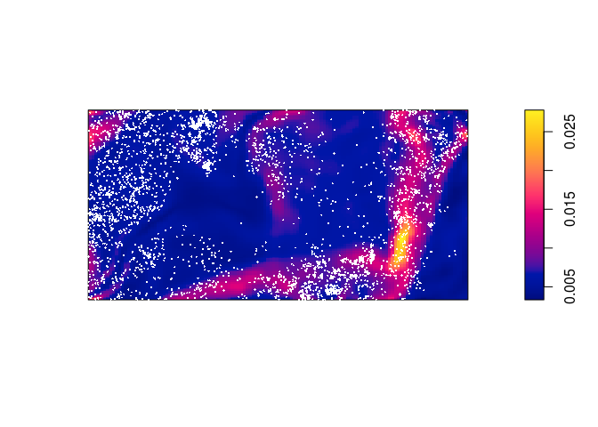

4.  extract the estimated variance-covariance matrix of the coefficient estimates, using `vcov`.

    We call `vcov` on the fitted model object:

    ``` r
    vcov(bei.m)
    ```

        ##               (Intercept)          elev          grad
        ## (Intercept)  0.1163496911 -7.774152e-04 -0.0354946468
        ## elev        -0.0007774152  5.233903e-06  0.0001993179
        ## grad        -0.0354946468  1.993179e-04  0.0654647795

5.  Compute and plot the standard error of the intensity estimate (see `help(predict.ppm)`).

    From the documentation the argument `se` will trigger the computation of the standard errors. These are then plotted in the standard manner.

    ``` r
    std.err <- predict(bei.m, se = TRUE)$se
    plot(std.err, main = "")
    ```

    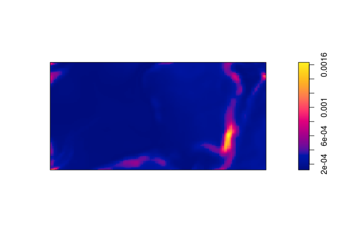

### Exercise 6

Fit Poisson point process models to the Japanese Pines data, with the following trend formulas. Read off an expression for the fitted intensity function in each case.

<table style="width:89%;">
<colgroup>
<col width="26%" />
<col width="62%" />
</colgroup>
<thead>
<tr class="header">
<th align="left">Trend formula</th>
<th align="left">Fitted intensity function</th>
</tr>
</thead>
<tbody>
<tr class="odd">
<td align="left"><code>~1</code></td>
<td align="left"><span class="math inline">log<em>λ</em>(<em>u</em>)=4.17</span></td>
</tr>
<tr class="even">
<td align="left"><code>~x</code></td>
<td align="left"><span class="math inline">log<em>λ</em>(<em>u</em>)=4.28 − 0.23<em>x</em></span></td>
</tr>
<tr class="odd">
<td align="left"><code>~sin(x)</code></td>
<td align="left"><span class="math inline">log<em>λ</em>(<em>u</em>)=4.29 − 0.26sin(<em>x</em>)</span></td>
</tr>
<tr class="even">
<td align="left"><code>~x+y</code></td>
<td align="left"><span class="math inline">log<em>λ</em>(<em>u</em>)=4.07 − 0.23<em>x</em> + 0.42<em>y</em></span></td>
</tr>
<tr class="odd">
<td align="left"><code>~polynom(x,y,2)</code></td>
<td align="left"><span class="math inline">log<em>λ</em>(<em>u</em>)=4.06 + 1.14<em>x</em> − 1.56<em>y</em> − 0.75<em>x</em><sup>2</sup> − 1.20<em>x</em><em>y</em> + 2.51<em>y</em><sup>2</sup></span></td>
</tr>
<tr class="even">
<td align="left"><code>~factor(x &lt; 0.4)</code></td>
<td align="left"><span class="math inline">log<em>λ</em>(<em>u</em>)=4.10 + 0.16 ⋅ <em>I</em>(<em>x</em> &lt; 0.4)</span></td>
</tr>
</tbody>
</table>

(Here, *I*(⋅) denote the indicator function.)

The fitted intensity functions have been written into the table based on the follwing model fits:

``` r
coef(ppm1 <- ppm(japanesepines ~ 1)) 
```

    ## log(lambda) 
    ##    4.174387

``` r
coef(ppm2 <- ppm(japanesepines ~ x))
```

    ## (Intercept)           x 
    ##   4.2895587  -0.2349362

``` r
coef(ppm3 <- ppm(japanesepines ~ sin(x)))
```

    ## (Intercept)      sin(x) 
    ##   4.2915935  -0.2594537

``` r
coef(ppm4 <- ppm(japanesepines ~ x + y))
```

    ## (Intercept)           x           y 
    ##   4.0670790  -0.2349641   0.4296171

``` r
coef(ppm5 <- ppm(japanesepines ~ polynom(x, y, 2)))
```

    ## (Intercept)           x           y      I(x^2)    I(x * y)      I(y^2) 
    ##   4.0645501   1.1436854  -1.5613621  -0.7490094  -1.2009245   2.5061569

``` r
coef(ppm6 <- ppm(japanesepines ~ factor(x < 0.4)))
```

    ##         (Intercept) factor(x < 0.4)TRUE 
    ##           4.1048159           0.1632665

### Exercise 7

Make image plots of the fitted intensities for the inhomogeneous models above.

Again, we use `plot(predict())`:

``` r
plot(predict(ppm1), main = "")
```


``` r
plot(predict(ppm2), main = "")
```

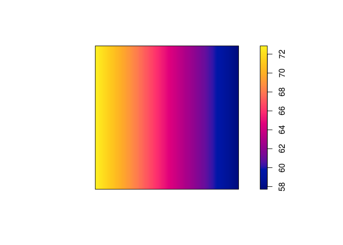

``` r
plot(predict(ppm3), main = "")
```

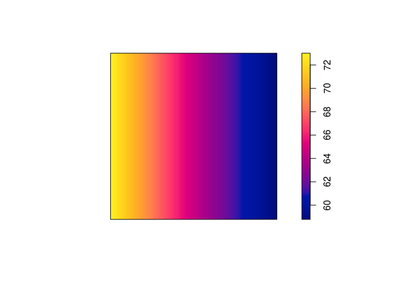

``` r
plot(predict(ppm4), main = "")
```

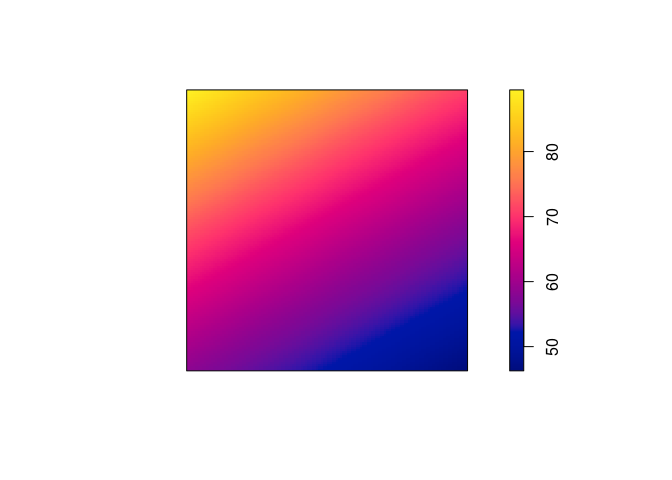

``` r
plot(predict(ppm5), main = "")
```

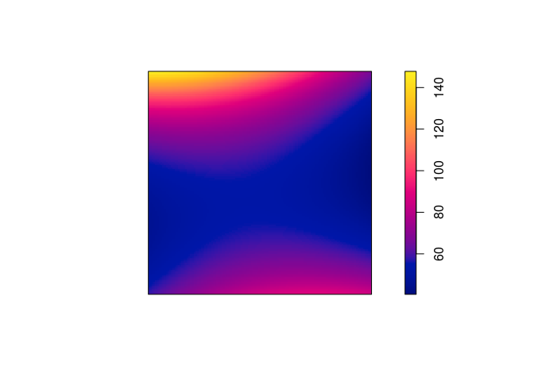

``` r
plot(predict(ppm6), main = "")
```

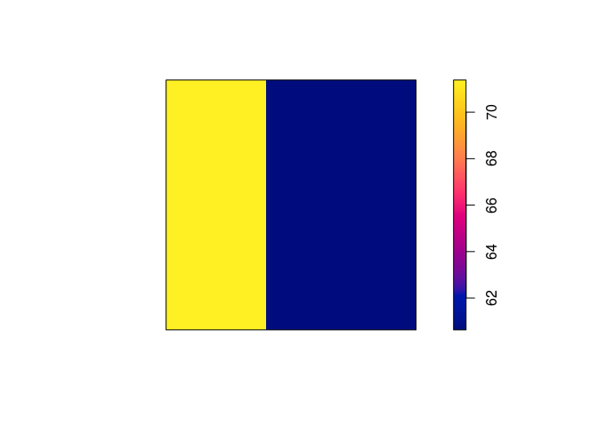
