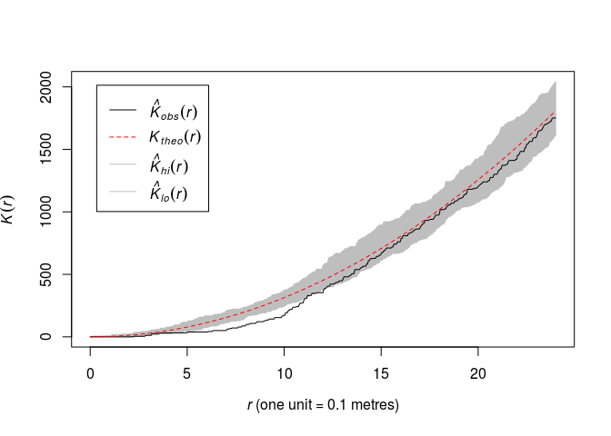
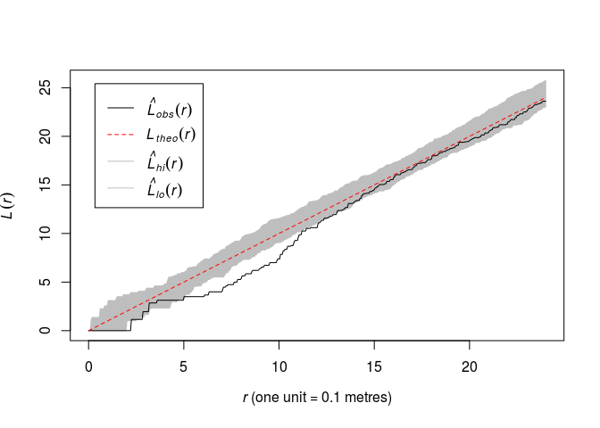
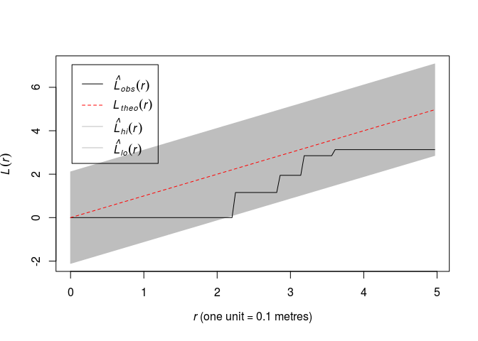
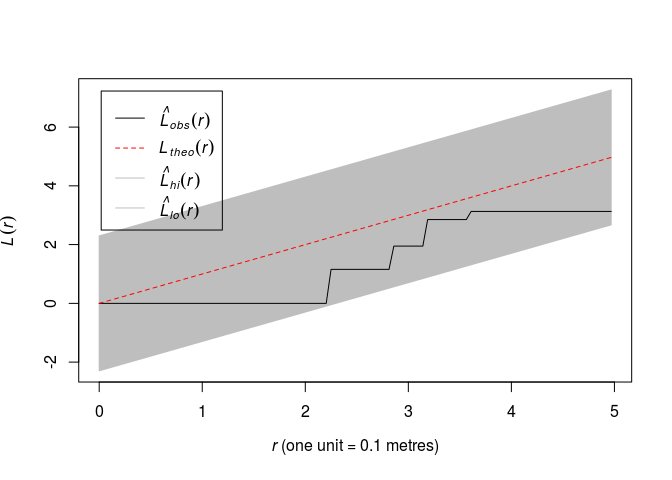
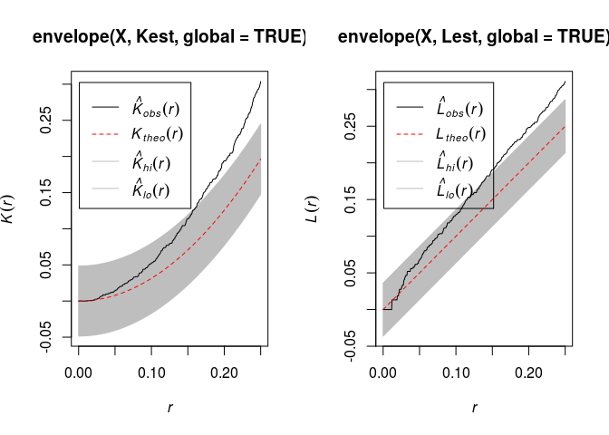
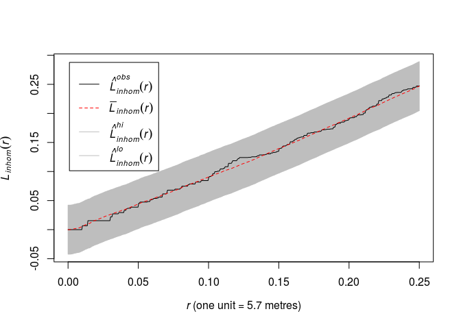

Lab 7: Envelopes and Monte Carlo tests
================

This session is concerned with evelopes of summary statistics and Monte Carlo tests.
The lecturer's R script is [available here](https://raw.githubusercontent.com/spatstat/SSAI2017/master/Scripts/script07.R) (right click and save).

``` r
library(spatstat)
```

### Exercise 1

For the `swedishpines` data:

1.  Plot the *K* function along with pointwise envelopes from 39 simulations of CSR:

    ``` r
    plot(envelope(swedishpines, Kest, nsim=39))
    ```

    OK,

    ``` r
    plot(envelope(swedishpines, Kest, nsim=39), main = "")
    ```

        ## Generating 39 simulations of CSR  ...
        ## 1, 2, 3, 4, 5, 6, 7, 8, 9, 10, 11, 12, 13, 14, 15, 16, 17, 18, 19, 20, 21, 22, 23, 24, 25, 26, 27, 28, 29, 30, 31, 32, 33, 34, 35, 36, 37, 38,
        ##  39.
        ## 
        ## Done.

    

2.  Plot the *L* function along with pointwise envelopes from 39 simulations of CSR.

    Like above now with `Lest`:

    ``` r
    plot(envelope(swedishpines, Lest, nsim=39), main = "")
    ```

        ## Generating 39 simulations of CSR  ...
        ## 1, 2, 3, 4, 5, 6, 7, 8, 9, 10, 11, 12, 13, 14, 15, 16, 17, 18, 19, 20, 21, 22, 23, 24, 25, 26, 27, 28, 29, 30, 31, 32, 33, 34, 35, 36, 37, 38,
        ##  39.
        ## 
        ## Done.

    

3.  Plot the *L* function along with **simultaneous** envelopes from **19** simulations of CSR, using `ginterval=c(0,5)`.

    ``` r
    plot(envelope(swedishpines, Lest, nsim = 19, global = TRUE, ginterval=c(0,5)), main = "")
    ```

        ## Generating 19 simulations of CSR  ...
        ## 1, 2, 3, 4, 5, 6, 7, 8, 9, 10, 11, 12, 13, 14, 15, 16, 17, 18,  19.
        ## 
        ## Done.

    

4.  Plot the *L* function for along with **simultaneous** envelopes from **99** simulations of CSR using `ginterval=c(0,5)`. What is the significance level of the associated test?

    ``` r
    plot(envelope(swedishpines, Lest, nsim = 99, global = TRUE, ginterval=c(0,5)), main = "")
    ```

        ## Generating 99 simulations of CSR  ...
        ## 1, 2, 3, 4, 5, 6, 7, 8, 9, 10, 11, 12, 13, 14, 15, 16, 17, 18, 19, 20, 21, 22, 23, 24, 25, 26, 27, 28, 29, 30, 31, 32, 33, 34, 35, 36, 37, 38,
        ## 39, 40, 41, 42, 43, 44, 45, 46, 47, 48, 49, 50, 51, 52, 53, 54, 55, 56, 57, 58, 59, 60, 61, 62, 63, 64, 65, 66, 67, 68, 69, 70, 71, 72, 73, 74, 75, 76,
        ## 77, 78, 79, 80, 81, 82, 83, 84, 85, 86, 87, 88, 89, 90, 91, 92, 93, 94, 95, 96, 97, 98,  99.
        ## 
        ## Done.

    

    Which yields an 1% significance test.

### Exercise 2

To understand the difficulties with the *K*-function when the point pattern is not spatially homogeneous, try the following experiment (like in the previous lab session).

1.  Generate a simulated realisation of an inhomogeneous Poisson process, e.g.

    ``` r
    X <- rpoispp(function(x,y){ 200 * exp(-3 * x) })
    ```

    OK,

    ``` r
    X <- rpoispp(function(x,y){ 200 * exp(-3 * x) })
    ```

2.  Compute simulation envelopes (of your favorite type) of the *K*- or *L*-function under CSR. They may well indicate significant departure from CSR.

    There indeed often seems to be a departure from CSR:

    ``` r
    par(mfrow=c(1,2))
    plot(envelope(X, Kest, global = TRUE))
    ```

        ## Generating 99 simulations of CSR  ...
        ## 1, 2, 3, 4, 5, 6, 7, 8, 9, 10, 11, 12, 13, 14, 15, 16, 17, 18, 19, 20, 21, 22, 23, 24, 25, 26, 27, 28, 29, 30, 31, 32, 33, 34, 35, 36, 37, 38,
        ## 39, 40, 41, 42, 43, 44, 45, 46, 47, 48, 49, 50, 51, 52, 53, 54, 55, 56, 57, 58, 59, 60, 61, 62, 63, 64, 65, 66, 67, 68, 69, 70, 71, 72, 73, 74, 75, 76,
        ## 77, 78, 79, 80, 81, 82, 83, 84, 85, 86, 87, 88, 89, 90, 91, 92, 93, 94, 95, 96, 97, 98,  99.
        ## 
        ## Done.

    ``` r
    plot(envelope(X, Lest, global = TRUE))
    ```

        ## Generating 99 simulations of CSR  ...
        ## 1, 2, 3, 4, 5, 6, 7, 8, 9, 10, 11, 12, 13, 14, 15, 16, 17, 18, 19, 20, 21, 22, 23, 24, 25, 26, 27, 28, 29, 30, 31, 32, 33, 34, 35, 36, 37, 38,
        ## 39, 40, 41, 42, 43, 44, 45, 46, 47, 48, 49, 50, 51, 52, 53, 54, 55, 56, 57, 58, 59, 60, 61, 62, 63, 64, 65, 66, 67, 68, 69, 70, 71, 72, 73, 74, 75, 76,
        ## 77, 78, 79, 80, 81, 82, 83, 84, 85, 86, 87, 88, 89, 90, 91, 92, 93, 94, 95, 96, 97, 98,  99.
        ## 
        ## Done.

    

3.  Fit a Poisson point process model to the `japanesepines` data with log-quadratic trend (formula `~polynom(x,y,2)`). Plot the *L*-function of the data along with simultaneous envelopes from 99 simulations **of the fitted model**.

    This can be done by the code:

    ``` r
    fit <- ppm(japanesepines ~ polynom(x, y, 2))
    plot(envelope(fit, Linhom, global = TRUE), main = "")
    ```

        ## Generating 198 simulated realisations of fitted Poisson model (99 to 
        ## estimate the mean and 99 to calculate envelopes) ...
        ## 1, 2, 3, 4.6.8.10.12.14.16.18.20.22.24.26.28.30.32.34.36.38.
        ## 40.42.44.46.48.50.52.54.56.58.60.62.64.66.68.70.72.74.76.78
        ## .80.82.84.86.88.90.92.94.96.98.100.102.104.106.108.110.112.114.116.
        ## 118.120.122.124.126.128.130.132.134.136.138.140.142.144.146.148.150.152.154.156
        ## .158.160.162.164.166.168.170.172.174.176.178.180.182.184.186.188.190.192.194.
        ## 196. 198.
        ## 
        ## Done.

    
