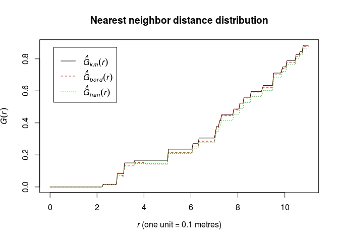
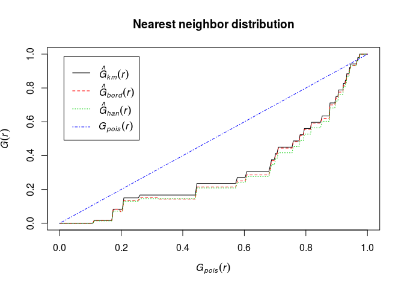
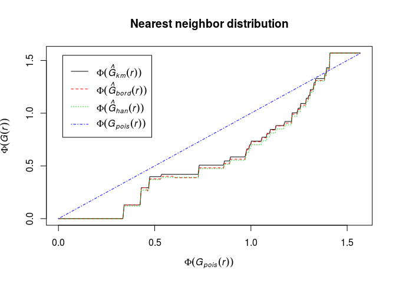
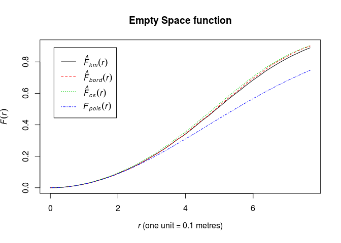
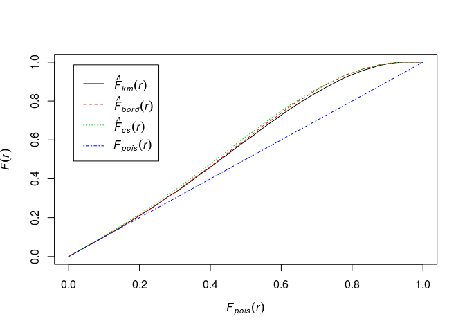
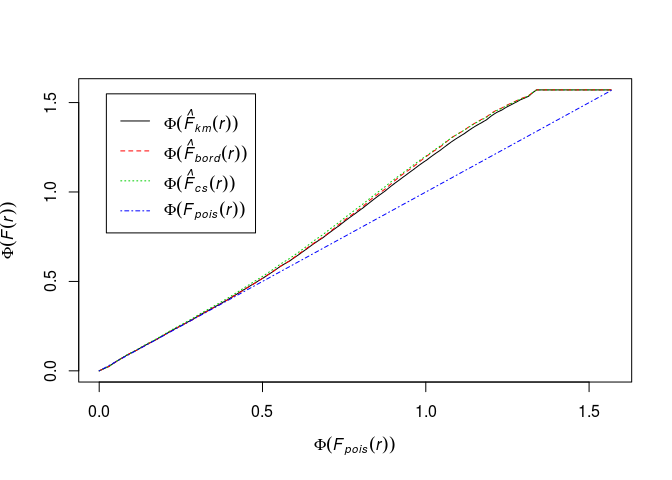

Lab 8: Spacing and distances
================

This session is concerned with summary statistics for spacings and interpoint distances.
The lecturer's R script is [available here](https://raw.githubusercontent.com/spatstat/Melb2018/master/Scripts/script08.R) (right click and save).

``` {.r}
library(spatstat)
```

    ## Loading required package: spatstat.data

    ## Loading required package: methods

    ## Loading required package: nlme

    ## Loading required package: rpart

    ## 
    ## spatstat 1.56-1.007       (nickname: 'Damn You Autocorrect') 
    ## For an introduction to spatstat, type 'beginner'

### Exercise 1

For the `swedishpines` data:

1.  Calculate the estimate of the nearest neighbour distance distribution function \(G\) using `Gest`.

    ``` {.r}
    G <- Gest(swedishpines)
    ```

2.  Plot the estimate of \(G(r)\) against \(r\)

    ``` {.r}
    plot(G, cbind(km, rs, han) ~ r, main = "Nearest neighbor distance distribution")
    ```

    

3.  Plot the estimate of \(G(r)\) against the theoretical (Poisson) value \(G_{\mbox{pois}}(r) = 1 - \exp(-\lambda \pi r^2)\).

    E.g.

    ``` {.r}
    plot(G, . ~ theo, main = "Nearest neighbor distribution")
    ```

    

4.  Define Fisher’s variance-stabilising transformation for c.d.f.’s by

    ``` {.r}
    Phi <- function(x) asin(sqrt(x))
    ```

    Plot the \(G\) function using the formula `Phi(.) ~ Phi(theo)` and interpret it.

    ``` {.r}
    Phi <- function(x) asin(sqrt(x))
    plot(G, Phi(.) ~ Phi(theo), main = "Nearest neighbor distribution")
    ```

    

    The transformation has made the deviations from CSR in the central part of the curve smaller. We need envelopes to say anything about significance.

### Exercise 2

For the `swedishpines` data:

1.  Calculate the estimate of the nearest neighbour distance distribution function \(F\) using `Fest`.

    ``` {.r}
    Fhat <- Fest(swedishpines)
    ```

2.  Plot the estimate of \(F(r)\) against \(r\)

    ``` {.r}
    plot(Fhat, main = "Empty Space function")
    ```

    

3.  Plot the estimate of \(F(r)\) against the theoretical (Poisson) value \(F_{\mbox{pois}}(r) = 1 - \exp(-\lambda \pi r^2)\).

    ``` {.r}
    plot(Fhat, . ~ theo, main = "")
    ```

    

4.  Define Fisher’s variance-stabilising transformation for c.d.f.’s by

    ``` {.r}
    Phi <- function(x) asin(sqrt(x))
    ```

    Plot the \(F\) function using the formula `Phi(.) ~ Phi(theo)` and interpret it.

    ``` {.r}
    Phi <- function(x) asin(sqrt(x))
    plot(Fhat, Phi(.) ~ Phi(theo), main = "")
    ```

    

    The transformation has changed the picture much. It looks like deviation from CSR, but again, without envelopes it's hard to draw conclusions.
