Lab 9: Cluster and Cox processes
================

This session is concerned with summary statistics for interpoint spacing and distances.
The lecturer's R script is [available here](https://raw.githubusercontent.com/spatstat/SSAI2017/master/Scripts/script09.R) (right click and save).

``` r
library(spatstat)
```

### Exercise 1

The command `rThomas` generates simulated realisations of the Thomas model (‘modified Thomas cluster process’).

1.  Read the help file.

    See `help("rThomas")`.

2.  Type `plot(rThomas(10, 0.05, 8))` a few times, and interpret the results.

    ``` r
    replicate(3, plot(rThomas(10, 0.05, 8), main = ""))
    ```

    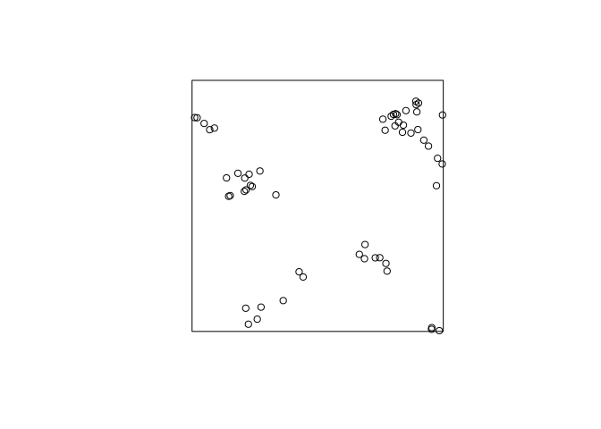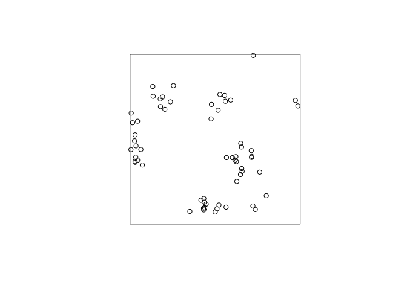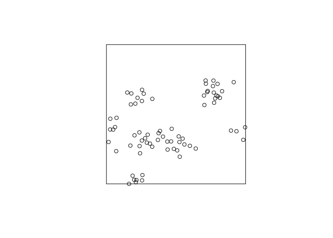

    A clustered process -- on average 10 clusters with 8 points. The standard deviation of the cluster distribution is 0.05, so most points will be within distance 0.10 from their parent.

3.  Experiment with the arguments of `rThomas` to obtain point patterns that

    1.  consist of a few, well-separated, very tight clusters of points;

    2.  look similar to realisations of a uniform Poisson process.

    We get few clusters by reducing the intensity of the parent process (first argument). Tightly and separated clusters are obtained by reducing the standard deviation (second argument).

    ``` r
    plot(rThomas(5, 0.01, 8), main = "")
    ```

    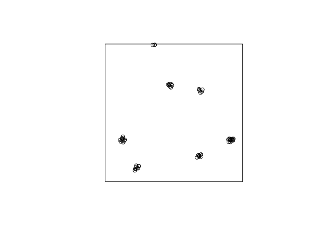

    If the are many clusters with a large standard deviation it looks like Poisson.

    ``` r
    plot(rThomas(100, 1, 1), main = "")
    ```

    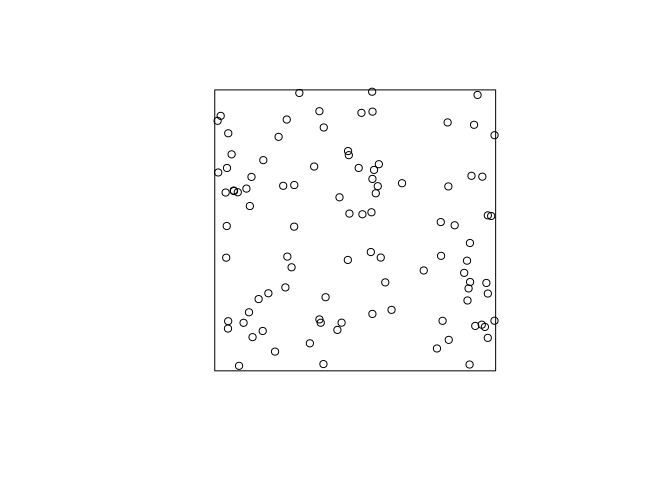

### Exercise 2

1.  Read the help file for `kppm`.

    See `help("kppm")`.

2.  Fit the Thomas model to the `redwood` data by the method of minimum contrast:

    ``` r
    fit <- kppm(redwood ~ 1, clusters="Thomas")
    fit
    plot(fit)
    ```

    From the documentation, the minmum contrast fitting procedure is default. Hence, we need not specify it.

    ``` r
    fit <- kppm(redwood ~ 1, clusters = "Thomas")
    fit
    ```

        ## Stationary cluster point process model
        ## Fitted to point pattern dataset 'redwood'
        ## Fitted by minimum contrast
        ##  Summary statistic: K-function
        ## 
        ## Uniform intensity:   62
        ## 
        ## Cluster model: Thomas process
        ## Fitted cluster parameters:
        ##      kappa      scale 
        ## 23.5511449  0.0470461 
        ## Mean cluster size:  2.632568 points

    ``` r
    plot(fit, main = "", pause = FALSE) 
    ```

        ## Warning in density.ppp(locations, kernel = model, ...): Bandwidth selection
        ## will be based on Gaussian kernel

    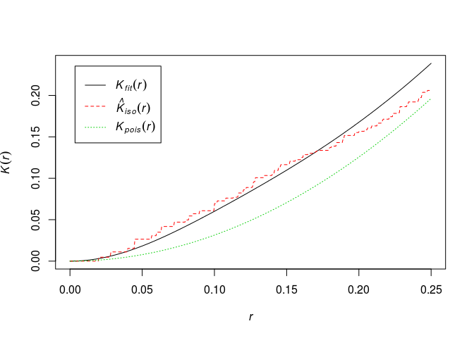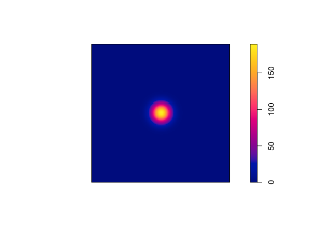

3.  Read off the parameters of the fitted model, and generate a simulated realisation of the fitted model using `rThomas`.

    From the previous output, we can read off the parameters to do the simulation (or we can use `parameters` to extract them):

    ``` r
    (p <- parameters(fit))
    ```

        ## $trend
        ## [1] 62
        ## 
        ## $kappa
        ## [1] 23.55114
        ## 
        ## $scale
        ## [1] 0.0470461
        ## 
        ## $mu
        ## [1] 2.632568

    ``` r
    rt2 <- rThomas(kappa = p$kappa, scale = p$scale, mu = p$mu)
    plot(rt2, main = "")
    ```

    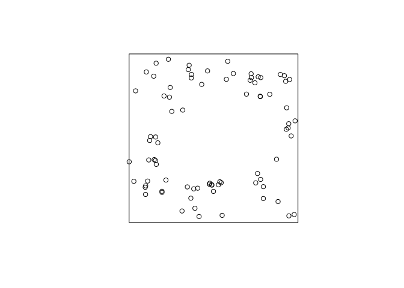

4.  Type `plot(simulate(fit))` to generate a simulated realisation of the fitted model automatically.

    OK, let try that alternative:

    ``` r
    plot(simulate(fit, drop = TRUE), main = "")
    ```

    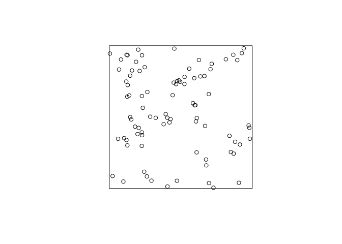

5.  Try the command

    ``` r
    fit2 <- kppm(redwood ~ 1, clusters="Thomas", startpar=c(kappa=10, scale=0.1))
    ```

    and briefly explore the fitting algorithm’s sensitivity to the initial guesses at the parameter values `kappa` and `scale`.

    For "large" kappa (parent intensity) and "small" scale (standard deviation), the algorithm seems quite robust:

    ``` r
    kppm(redwood ~ 1, clusters="Thomas", startpar=c(kappa=10, scale=0.1))
    ```

        ## Stationary cluster point process model
        ## Fitted to point pattern dataset 'redwood'
        ## Fitted by minimum contrast
        ##  Summary statistic: K-function
        ## 
        ## Uniform intensity:   62
        ## 
        ## Cluster model: Thomas process
        ## Fitted cluster parameters:
        ##       kappa       scale 
        ## 23.54757642  0.04704921 
        ## Mean cluster size:  2.632967 points

    ``` r
    kppm(redwood ~ 1, clusters="Thomas", startpar=c(kappa=100, scale=0.01))
    ```

        ## Stationary cluster point process model
        ## Fitted to point pattern dataset 'redwood'
        ## Fitted by minimum contrast
        ##  Summary statistic: K-function
        ## 
        ## Uniform intensity:   62
        ## 
        ## Cluster model: Thomas process
        ## Fitted cluster parameters:
        ##       kappa       scale 
        ## 23.54962713  0.04705395 
        ## Mean cluster size:  2.632738 points

    However, for a very small parent intensity (kappa) and large offspring scale the fit changes considerably.

    ``` r
    kppm(redwood ~ 1, clusters="Thomas", startpar=c(kappa=0.1, scale=10))
    ```

        ## Stationary cluster point process model
        ## Fitted to point pattern dataset 'redwood'
        ## Fitted by minimum contrast
        ##  Summary statistic: K-function
        ## 
        ## Uniform intensity:   62
        ## 
        ## Cluster model: Thomas process
        ## Fitted cluster parameters:
        ##       kappa       scale 
        ## 0.001824317 9.427722055 
        ## Mean cluster size:  33985.33 points

6.  Generate and plot several simulated realisations of the fitted model, to assess whether it is plausible.

    ``` r
    XX <- simulate(fit, nsim = 11)
    ```

        ## Generating 11 simulations... 1, 2, 3, 4, 5, 6, 7, 8, 9, 10,  11.
        ## Done.

    ``` r
    XX[[12]] <- redwood
    plot(XX, main = "", main.panel = "")
    ```

    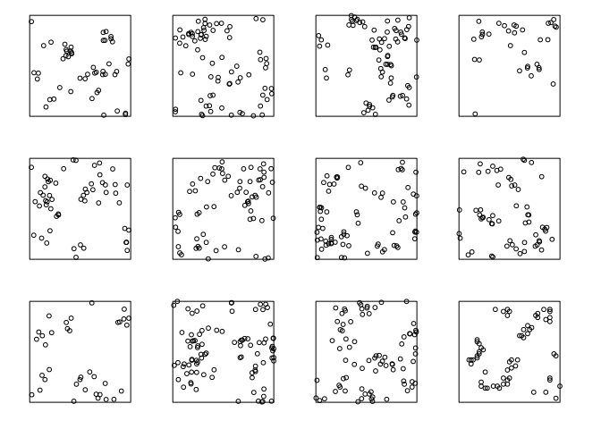

    The actual data do not look too different from the simulated (apart from the artificial discretisation in the real data which can be seen on larger plots).

7.  Extract and plot the fitted pair correlation function by

    ``` r
    pcffit <- pcfmodel(fit)
    plot(pcffit, xlim = c(0, 0.3))
    ```

    OK, let's try that:

    ``` r
    pcffit <- pcfmodel(fit)
    plot(pcffit, xlim = c(0, 0.3), main = "pair correlation")
    ```

    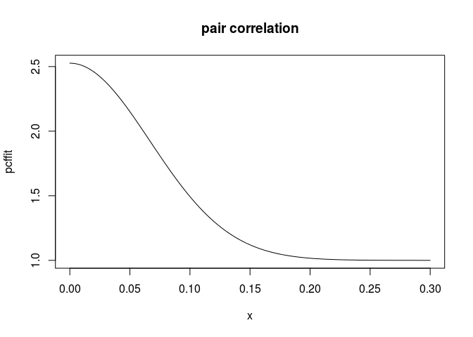

8.  Type `plot(envelope(fit, Lest, nsim=39))` to generate simulation envelopes of the *L* function from this fitted model. Do they suggest the model is plausible?

    ``` r
    plot(envelope(fit, Lest, nsim = 39, global = TRUE))
    ```

        ## Generating 78 simulated realisations of fitted cluster model (39 to 
        ## estimate the mean and 39 to calculate envelopes) ...
        ## 1, 2, 3, 4, 5, 6, 7, 8, 9, 10, 11, 12, 13, 14, 15, 16, 17, 18, 19, 20, 21, 22, 23, 24, 25, 26, 27, 28, 29, 30, 31, 32, 33, 34, 35, 36, 37, 38,
        ## 39, 40, 41, 42, 43, 44, 45, 46, 47, 48, 49, 50, 51, 52, 53, 54, 55, 56, 57, 58, 59, 60, 61, 62, 63, 64, 65, 66, 67, 68, 69, 70, 71, 72, 73, 74, 75, 76,
        ## 77,  78.
        ## 
        ## Done.

    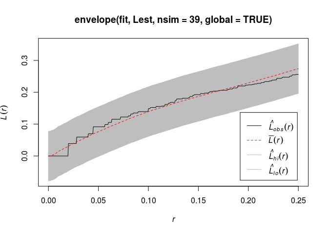

    Yes, the model seems plausible and it does not devivated from the envelope.

### Exercise 3

1.  Fit a Matern cluster process to the `redwood` data.

    We fit the Matern cluster process by specifying the `clusters` argument to be `MatClust`.

    ``` r
    mfit <- kppm(redwood ~ 1, clusters = "MatClust")
    ```

2.  Use `vcov` to estimate the covariance matrix of the parameter estimates.

    The variance (covariance matrix) is computed straightforwardly:

    ``` r
    vcov(mfit)
    ```

        ##             (Intercept)
        ## (Intercept)  0.05304008

3.  Compare with the covariance matrix obtained when fitting a homogeneous Poisson model.

    ``` r
    vcov(ppm(redwood ~ 1))
    ```

        ##             log(lambda)
        ## log(lambda)  0.01612903

    As can be seen, the variance of the intensity estimate is quite a bit larger in the Matern model. This comes naturally by the doubly stochastic construction of the Matern model.
