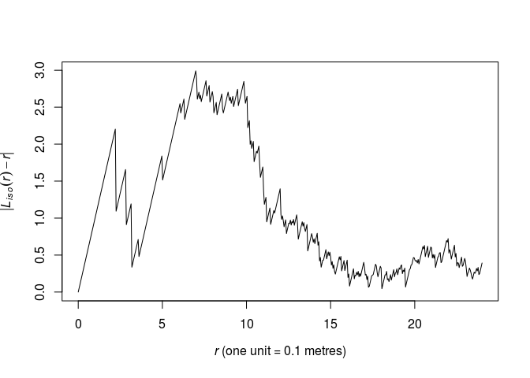
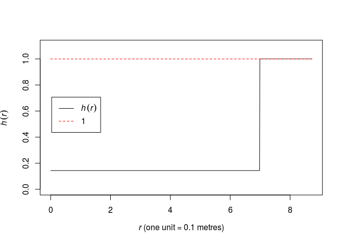
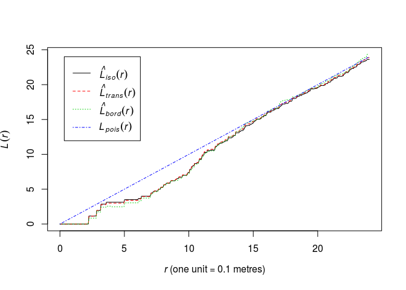
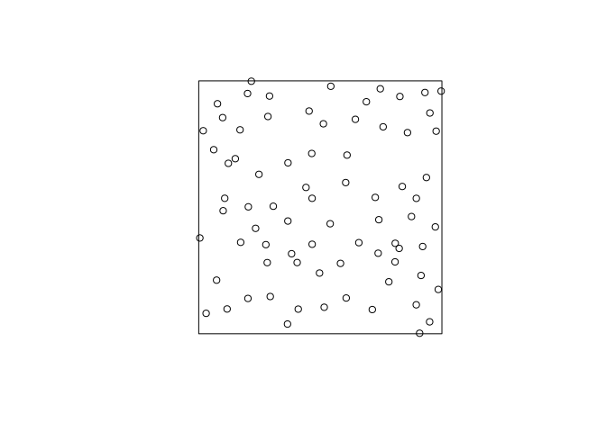
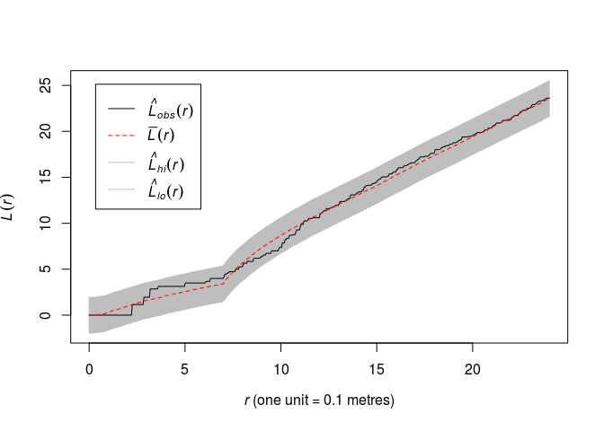
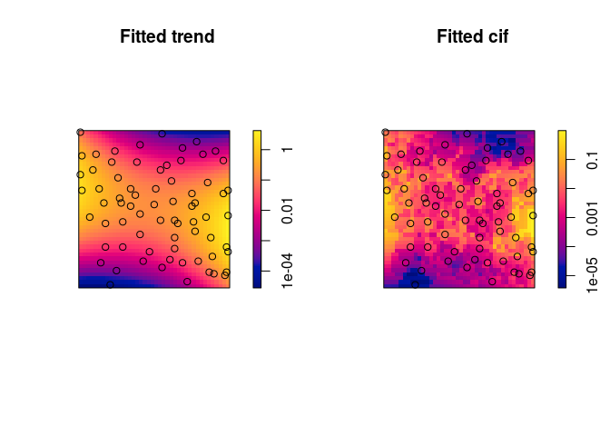

Lab 10: Gibbs processes
================

This session is concerned with Gibbs models for point patterns with interpoint interaction.
The lecturer's R script is [available here](https://raw.githubusercontent.com/spatstat/SSAI2017/master/Scripts/script10.R) (right click and save).

``` r
library(spatstat)
```

### Exercise 1

In this question we fit a Strauss point process model to the `swedishpines` data.

1.  We need a guess at the interaction distance *R*. Compute and plot the *L*-function of the dataset and choose the value *r* which maximises the discrepancy |*L*(*r*)−*r*|.

    We plot the above function which we want to maximize.

    ``` r
    plot(Lest(swedishpines), abs(iso - r) ~ r, main = "")
    ```

    

    As seen from the plot, the maximum lies around *r* = 6.5 by eye. We find the optimum explicitly like follows:

    ``` r
    discrep <- function(r) {
      return(abs(as.function(Lest(swedishpines))(r) - r))
    }
    res <- optimise(discrep, interval = c(0.1, 20), maximum = TRUE)
    print(res)
    ```

        ## $maximum
        ## [1] 6.984333
        ## 
        ## $objective
        ## [1] 2.992058

    ``` r
    R <- res$maximum
    ```

    This corresponds nicely with the plot.

2.  Fit the stationary Strauss model with the chosen interaction distance using

    ``` r
    ppm(swedishpines ~ 1, Strauss(R))
    ```

    where `R` is your chosen value.

3.  Interpret the printout: how strong is the interaction?

4.  Plot the fitted pairwise interaction function using `plot(fitin(fit))`.

    As we have assigned `R`, we simply write:

    ``` r
    fit <- ppm(swedishpines ~ 1, Strauss(R))
    print(fit)
    ```

        ## Stationary Strauss process
        ## 
        ## First order term:  beta = 0.0281221
        ## 
        ## Interaction distance:    6.984333
        ## Fitted interaction parameter gamma:   0.1434456
        ## 
        ## Relevant coefficients:
        ## Interaction 
        ##   -1.941799 
        ## 
        ## For standard errors, type coef(summary(x))

    As seen, the *γ* = 0.14 parameter is quite small. Thus there seems to be a strong negative association between points within distance R of each other. A *γ* of 0 implies the hard core process whereas *γ* = 1 implies the Poisson process and thus CSR.

    The pairwise interaction function become:

    ``` r
    plot(fitin(fit))
    ```

    

### Exercise 2

In Question 1 we guesstimated the Strauss interaction distance parameter. Alternatively this parameter could be estimated by profile pseudolikelihood.

1.  Look again at the plot of the *L*-function of `swedishpines` and determine a plausible range of possible values for the interaction distance.

    ``` r
    plot(Lest(swedishpines), main = "")
    ```

    

    A conservative range of plausible interaction distances seems to be 3 to 15 meters.

2.  Generate a sequence of values equally spaced across this range, for example, if your range of plausible values was \[0.05, 0.3\], then type

    ``` r
    rvals <- seq(0.05, 0.3, by=0.01)
    ```

    We generate the numbers between 3 and 12.

    ``` r
    rvals <- seq(3, 12, by = 0.1)
    ```

3.  Construct a data frame, with one column named `r` (matching the argument name of `Strauss`), containing these values. For example

    ``` r
    D <- data.frame(r = rvals)
    ```

    OK,

    ``` r
    D <- data.frame(r = rvals)
    ```

4.  Execute

    ``` r
    fitp <- profilepl(D, Strauss, swedishpines ~ 1)
    ```

    to find the maximum profile pseudolikelihood fit.

    OK, let's execute it:

    ``` r
    fitp <- profilepl(D, Strauss, swedishpines ~ 1)
    ```

        ## (computing rbord)

        ## comparing 91 models...

        ## 1, 2, 3, 4, 5, 6, 7, 8, 9, 10, 11, 12, 13, 14, 15, 16, 17, 18, 19, 20, 21, 22, 23, 24, 25, 26, 27, 28, 29, 30, 31, 32, 33, 34, 35, 36, 37, 38,
        ## 39, 40, 41, 42, 43, 44, 45, 46, 47, 48, 49, 50, 51, 52, 53, 54, 55, 56, 57, 58, 59, 60, 61, 62, 63, 64, 65, 66, 67, 68, 69, 70, 71, 72, 73, 74, 75, 76,
        ## 77, 78, 79, 80, 81, 82, 83, 84, 85, 86, 87, 88, 89, 90,  91.

        ## fitting optimal model...

        ## done.

5.  Print and plot the object `fitp`.

    ``` r
    print(fitp)
    ```

        ## profile log pseudolikelihood
        ## for model:  ppm(swedishpines ~ 1,  interaction = Strauss)
        ## fitted with rbord = 12
        ## interaction: Strauss process
        ## irregular parameter: r in [3, 12]
        ## optimum value of irregular parameter:  r = 9.8

    ``` r
    plot(fitp)
    ```

    

6.  Compare the computed estimate of interaction distance *r* with your guesstimate. Compare the corresponding estimates of the Strauss interaction parameter *γ*.

    ``` r
    (Ropt <- reach(as.ppm(fitp)))
    ```

        ## [1] 9.8

    The *r* = 9.8 is not totally inconsistent with the previous estimate of 7.

7.  Extract the fitted Gibbs point process model from the object `fitp` as

    ``` r
    bestfit <- as.ppm(fitp)
    ```

    OK, let's do that:

    ``` r
    bestfit <- as.ppm(fitp)
    ```

### Exercise 3

For the Strauss model fitted in Question 1,

1.  Generate and plot a simulated realisation of the fitted model using `simulate`.

    ``` r
    s <- simulate(fit, drop = TRUE)
    plot(s, main = "")
    ```

    

2.  Plot the *L*-function of the data along with the global simulation envelopes from 19 realisations of the fitted model.

    ``` r
    plot(envelope(fit, Lest, global = TRUE, nsim = 19, nsim2 = 100), main = "")
    ```

        ## Generating 119 simulated realisations of fitted Gibbs model (100 to 
        ## estimate the mean and 19 to calculate envelopes) ...
        ## 1, 2, 3, 4.6.8.10.12.14.16.18.20.22.24.26.28.30.32.34.36.38.
        ## 40.42.44.46.48.50.52.54.56.58.60.62.64.66.68.70.72.74.76.78
        ## .80.82.84.86.88.90.92.94.96.98.100.102.104.106.108.110.112.114.116.
        ## 118 119.
        ## 
        ## Done.

    

### Exercise 4

1.  Read the help file for `Geyer`.

    See `help(Geyer)`

2.  Fit a stationary Geyer saturation process to `swedishpines`, with the same interaction distance as for the Strauss model computed in Question 2, and trying different values of the saturation parameter `sat = 1, 2, 3` say.

    ``` r
    ppm(swedishpines ~ 1, Geyer(r = Ropt, sat = 1))
    ```

        ## Stationary Geyer saturation process
        ## 
        ## First order term:  beta = 0.07472669
        ## 
        ## Interaction distance:    9.8
        ## Saturation parameter:    1
        ## Fitted interaction parameter gamma:   0.1871555
        ## 
        ## Relevant coefficients:
        ## Interaction 
        ##   -1.675815 
        ## 
        ## For standard errors, type coef(summary(x))

    ``` r
    ppm(swedishpines ~ 1, Geyer(r = Ropt, sat = 2))
    ```

        ## Stationary Geyer saturation process
        ## 
        ## First order term:  beta = 0.04707047
        ## 
        ## Interaction distance:    9.8
        ## Saturation parameter:    2
        ## Fitted interaction parameter gamma:   0.5242884
        ## 
        ## Relevant coefficients:
        ## Interaction 
        ##  -0.6457134 
        ## 
        ## For standard errors, type coef(summary(x))

    ``` r
    ppm(swedishpines ~ 1, Geyer(r = Ropt, sat = 3))
    ```

        ## Stationary Geyer saturation process
        ## 
        ## First order term:  beta = 0.07603509
        ## 
        ## Interaction distance:    9.8
        ## Saturation parameter:    3
        ## Fitted interaction parameter gamma:   0.5261429
        ## 
        ## Relevant coefficients:
        ## Interaction 
        ##  -0.6421823 
        ## 
        ## For standard errors, type coef(summary(x))

3.  Fit the same model with the addition of a log-quadratic trend.

    ``` r
    gfit <- ppm(swedishpines ~ polynom(x, y, 2), Geyer(r = Ropt, sat = 3))
    ```

4.  Plot the fitted trend and conditional intensity.

    Here we use the log scale to be able to see the discs in the conditional intensity.

    ``` r
    par(mfrow=c(1,2))
    plot(gfit, log = TRUE, pause = FALSE)
    ```

    

### Exercise 5

Modify question 1 by using the Huang-Ogata approximate maximum likelihood algorithm (`method="ho"`) instead of maximum pseudolikelihood (the default, `method="mpl"`).

``` r
fit.mpl <- ppm(swedishpines ~ 1, Strauss(R), method = "mpl")
fit.ho  <- ppm(swedishpines ~ 1, Strauss(R), method = "ho")
```

    ## Simulating... 1, 2, 3, 4, 5, 6, 7, 8, 9, 10, 11, 12, 13, 14, 15, 16, 17, 18, 19, 20, 21, 22, 23, 24, 25, 26, 27, 28, 29, 30, 31, 32, 33, 34, 35, 36, 37, 38,
    ## 39, 40, 41, 42, 43, 44, 45, 46, 47, 48, 49, 50, 51, 52, 53, 54, 55, 56, 57, 58, 59, 60, 61, 62, 63, 64, 65, 66, 67, 68, 69, 70, 71, 72, 73, 74, 75, 76,
    ## 77, 78, 79, 80, 81, 82, 83, 84, 85, 86, 87, 88, 89, 90, 91, 92, 93, 94, 95, 96, 97, 98, 99,  100.
    ## Done.

``` r
print(fit.ho)
```

    ## Stationary Strauss process
    ## 
    ## First order term:  beta = 0.03025998
    ## 
    ## Interaction distance:    6.984333
    ## Fitted interaction parameter gamma:   0.1473619
    ## 
    ## Relevant coefficients:
    ## Interaction 
    ##   -1.914864 
    ## 
    ## For standard errors, type coef(summary(x))

``` r
print(fit.mpl)
```

    ## Stationary Strauss process
    ## 
    ## First order term:  beta = 0.0281221
    ## 
    ## Interaction distance:    6.984333
    ## Fitted interaction parameter gamma:   0.1434456
    ## 
    ## Relevant coefficients:
    ## Interaction 
    ##   -1.941799 
    ## 
    ## For standard errors, type coef(summary(x))

The fits are very similar.

### Exercise 6

Repeat Question 2 for the inhomogeneous Strauss process with log-quadratic trend. The corresponding call to `profilepl` is

``` r
fitp <- profilepl(D, Strauss, swedishpines ~ polynom(x,y,2))
```

``` r
fitp2 <- profilepl(D, Strauss, swedishpines ~ polynom(x,y,2))
```

    ## (computing rbord)

    ## comparing 91 models...

    ## 1, 2, 3, 4, 5, 6, 7, 8, 9, 10, 11, 12, 13, 14, 15, 16, 17, 18, 19, 20, 21, 22, 23, 24, 25, 26, 27, 28, 29, 30, 31, 32, 33, 34, 35, 36, 37, 38,
    ## 39, 40, 41, 42, 43, 44, 45, 46, 47, 48, 49, 50, 51, 52, 53, 54, 55, 56, 57, 58, 59, 60, 61, 62, 63, 64, 65, 66, 67, 68, 69, 70, 71, 72, 73, 74, 75, 76,
    ## 77, 78, 79, 80, 81, 82, 83, 84, 85, 86, 87, 88, 89, 90,  91.

    ## fitting optimal model...

    ## done.

``` r
print(fitp)
```

    ## profile log pseudolikelihood
    ## for model:  ppm(swedishpines ~ 1,  interaction = Strauss)
    ## fitted with rbord = 12
    ## interaction: Strauss process
    ## irregular parameter: r in [3, 12]
    ## optimum value of irregular parameter:  r = 9.8

``` r
print(fitp2)
```

    ## profile log pseudolikelihood
    ## for model:  ppm(swedishpines ~ polynom(x,  y,  2),  interaction = Strauss)
    ## fitted with rbord = 12
    ## interaction: Strauss process
    ## irregular parameter: r in [3, 12]
    ## optimum value of irregular parameter:  r = 9.8

### Exercise 7

Repeat Question 3 for the inhomogeneous Strauss process with log-quadratic trend, using the inhomogeneous *L*-function `Linhom` in place of the usual *L*-function.

``` r
fit2 <- as.ppm(fitp2)
plot(envelope(fit2, Linhom, global = TRUE, nsim = 19, nsim2 = 100), main = "")
```

    ## Generating 119 simulated realisations of fitted Gibbs model (100 to 
    ## estimate the mean and 19 to calculate envelopes) ...
    ## 1, 2, 3, 4.6.8.10.12.14.16.18.20.22.24.26.28.30.32.34.36.38.
    ## 40.42.44.46.48.50.52.54.56.58.60.62.64.66.68.70.72.74.76.78
    ## .80.82.84.86.88.90.92.94.96.98.100.102.104.106.108.110.112.114.116.
    ## 118 119.
    ## 
    ## Done.


